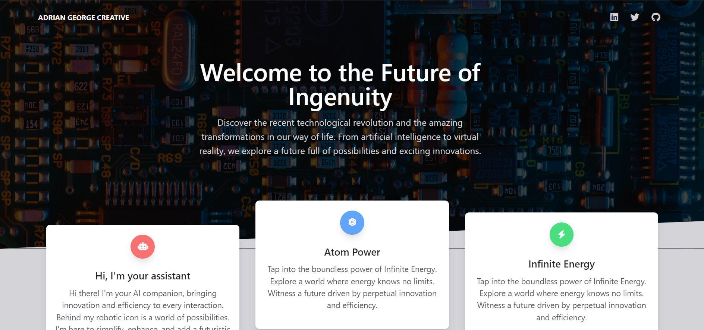
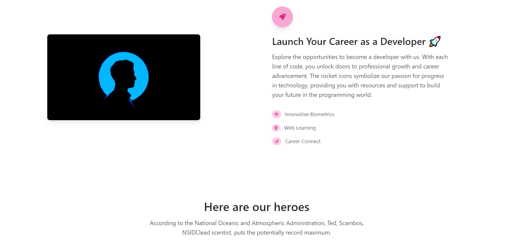

# Animated Template

This project is an animated template created by Jacinto Wong. It incorporates the ZTM (Zero To Mastery) VanillaJS framework and features animate-on-scroll functionality.

## Demo

View the live demo [here](https://lambrugeorge.github.io/animated-template/).

## Features

- **Animation on Scroll:** The template includes animated elements that trigger as the user scrolls down the page, providing a visually engaging experience.

## Technologies Used

- **HTML**
- **CSS**
- **JavaScript (VanillaJS)**
- **Tailwind CSS**

## Screenshots

## Author
Author's Name - @ZTM-Academy
